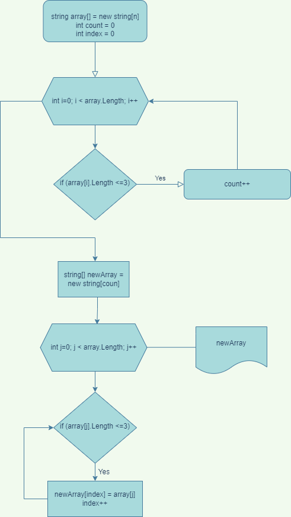

#Задача
* Написать программу, которая из имеющегося массива строк формирует новый массив из строк, длина которых меньше, либо равна 3 символам.

## Описание решения задачи

1. Ввести в консоль число, которое задаст нам количество элементов в массиве.
2. Ввести элементы (текст или цифры или символы) и нажать **Enter**.
3. Программа принимает от пользователя введённые данные, переводит их в массив.
4. Проверяет каждый элемент массива на соответствие условию.
5. Результатом работы программы является формирование нового массива элементов, которые меньше или равны 3 символам.

6. Алгоритм работы программы.

